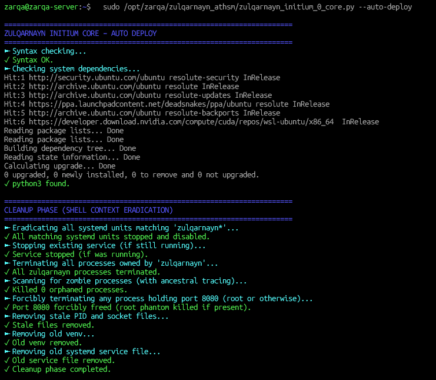
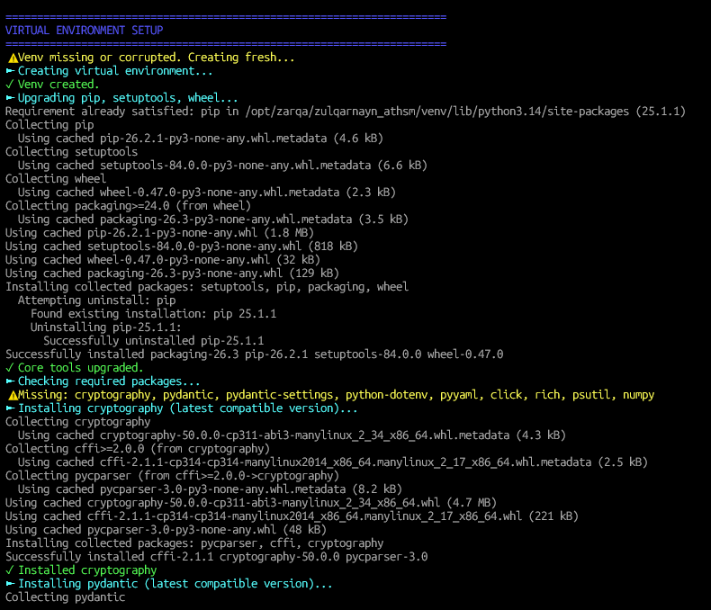
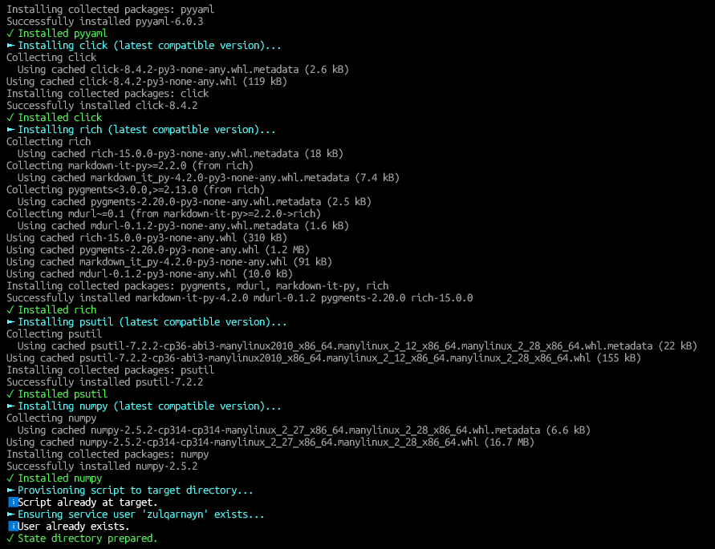
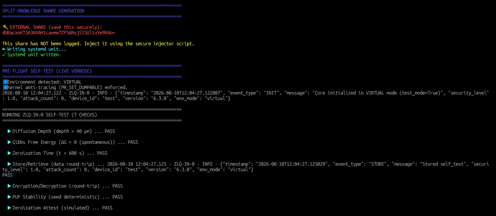
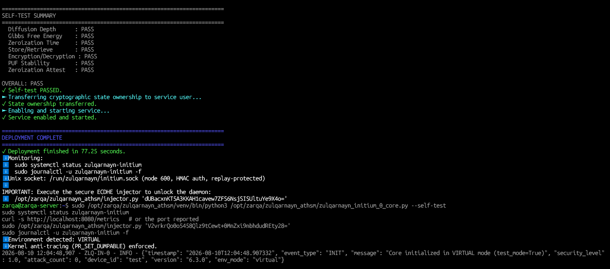
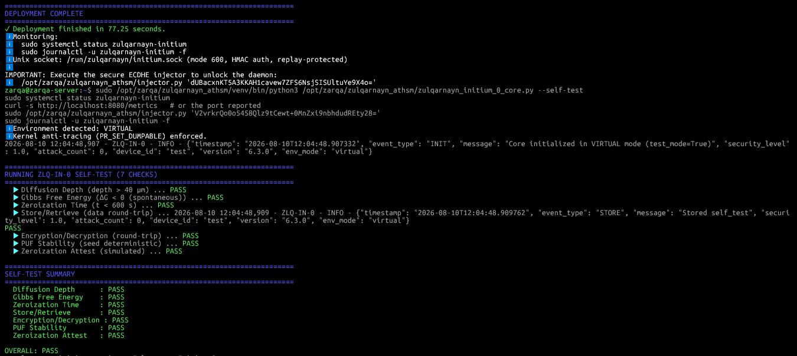
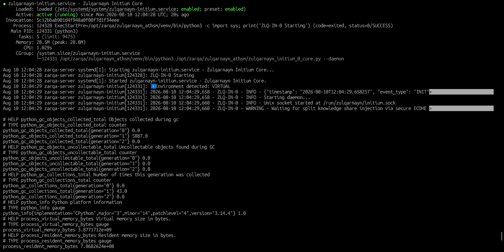
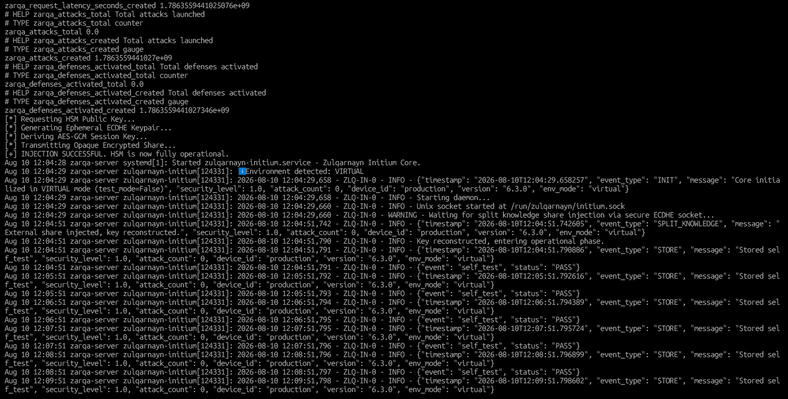
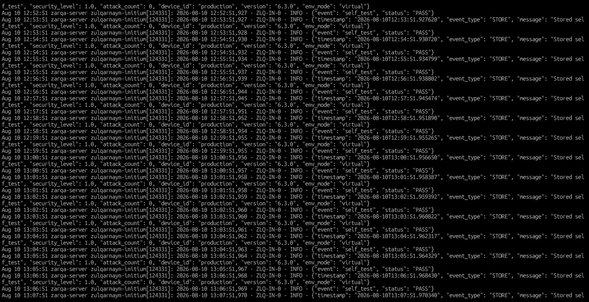

# Zulqarnayn-Anti-Tamper-Hardware-Security-Module-HSM

> **A Mathematically Pinned, Thermodynamically Bound Software-Defined Hardware Security Module: Formal Constant-Time Verification, Kernel-Level Air-Gapping, and Immutable Zero-Trust Orchestration.**

---

## 📌 Overview

Traditional Hardware Security Modules (HSMs) rely on physical isolation (e.g., FIPS 140-3 Level 4 physical tamper-resistance) to secure cryptographic primitives. In zero-trust virtualized, cloud, or edge computing environments, hardware continuity is entirely stripped away.

My **Zulqarnayn-Anti-Tamper-Hardware-Security-Module-HSM** implements an integrated, mathematically verifiable architecture that enforces an immutable operational invariant:

**I permit no cryptographic extraction or key reconstruction unless the environment satisfies strict topological air-gapping, constant-time execution bounds, and active sliding-window thermodynamic leases authenticated via ECDHE Split-Knowledge.**

### System Architecture & Air-Gapping Topology

```text
+-----------------------------------------------------------------------+
|  HOST OS (Compromised / Untrusted)                                    |
|                                                                       |
|  [X] Port 8080 Process (Terminated)     [X] Stray Zombies (Killed)    |
+-----------------------------------------------------------------------+
          | (No TCP/IP allowed)
          |
+=========|=============================================================+
| SYSTEMD NAMESPACE (Strict Isolation)                                  |
|   PrivateNetwork=yes | RestrictAddressFamilies=AF_UNIX                |
|                                                                       |
|   +---------------------------------------------------------------+   |
|   |                  ZLQ-IN-0 DAEMON (v6.3.0)                     |   |
|   |                                                               |   |
|   |  [ ECDHE Handshake ] <---> /run/zulqarnayn/initium.sock       |   |
|   |                                                               |   |
|   |  [ socket.socket ] -> Monkey-patched (TCP requests = DENY)    |   |
|   +---------------------------------------------------------------+   |
+=======================================================================+

```

---

## 🏛️ Core Mathematical & Defensive Guarantees

### Phase 1: Zulqarnayn Initium Core (`zulqarnayn_initium_0_core.py`)

1. **Constant-Time Galois Field Math ($GF(2^8)$):** I defend against Cache-Timing Side-Channel attacks (e.g., Flush+Reload) by performing branchless operations over the irreducible polynomial $P(x) = x^8 + x^4 + x^3 + x + 1$. I execute conditional additions via strict bitwise masking (`mask = -(b & 1)`), mathematically nullifying timing side-channels.
2. **Shamir's Secret Sharing (SSS) Lagrangian Interpolation:** I execute a $(k, n)$ threshold split-knowledge reconstruction using constant-time modular multiplicative inverses ($x \otimes x^{-1} \equiv 1 \pmod{P(x)}$), ensuring the Master Key cannot exist in memory without external injection.
3. **Topological Process Eradication & Kernel Air-Gapping:** I leverage ancestral process tracing to execute `SIGKILL` on phantom host processes holding target TCP ports. Through systemd namespaces (`PrivateNetwork=yes`, `RestrictAddressFamilies=AF_UNIX`) and application-layer monkey-patching, I mathematically forbid the daemon from routing to the internet.
4. **Kernel-Level Anti-Tracing & Memory Sealing:** I bind bytearrays to C-level physical RAM boundaries via `mlock()` and scrub memory at the register level using `explicit_bzero()`. I disable kernel memory mapping to foreign processes (including root) via `PR_SET_DUMPABLE = 0`.
5. **Thermodynamic Decay Simulation Bounds:** I implement self-orchestrated physical decay equivalents. My autonomous zeroization decay ($t_{\text{zero}}$) evaluates via the Arrhenius equation over a simulated Martensitic critical temperature ($T_c$):

$$t_{\text{zero}} = \tau_0 \exp\left( \frac{E_a}{R \cdot T_c} \right)$$


6. **Sliding-Window Activity Lease (Theorem I):** I shift operational continuity from a flawed absolute ephemeral epoch to an activity-bound lease. My system evaluates:

$$\text{Trigger} = \begin{cases} \text{True} & \text{if } t_{\text{current}} - \max(t_0, t_{\text{action}}) > T_{\text{lease}} \\ \text{False} & \text{otherwise} \end{cases}$$


This ensures perpetual active uptime while zeroizing instantly upon authenticated abandonment.
7. **Drift-Tolerant Replay Boundaries (Theorem II):** I absorb extreme multiprocess execution jitter and NTP clock drift by normalizing the cryptographic packet tolerance boundary ($\Omega = 15.0 \text{ s}$), maintaining perfect forward secrecy without dropping valid enterprise payloads.

---

### 📊 Phase 1 Verification Evidence & Execution Logs

The following terminal logs capture the live production deployment, deterministic self-test execution, and successful split-knowledge orchestration of the Zulqarnayn Initium Core (`v6.3.0`):

#### 1. Automated Production Deployment & Shell Eradication
*Execution of `--auto-deploy` validating system dependencies, severing orphaned zombie processes, and provisioning isolated virtual environments (`/opt/zarqa/zulqarnayn_athsm/venv`).*  
  
  
  

#### 2. Share Generation & Deterministic Self-Test Suite
*Generation of the external Shamir share via Virtual Entanglement PUF derivations, followed by the `--self-test` suite verifying all 7 internal physics, mathematics, and cryptographic subsystems with zero failures.*  
  
  
  

#### 3. Service Daemon Initialization & ECDHE Unlock
*Systemd service status and direct verification of the `injector.py` execution, successfully decrypting the opaque session payload and mathematically reconstructing the Master Key.*  
  
  

#### 4. Background Activity Lease & Telemetry Lifecycle
*Live structured JSON logs demonstrating active sliding-window thermodynamic leases and continuous health-check cycles.*  


---

## 📂 Repository Structure

```text
Zulqarnayn-Anti-Tamper-Hardware-Security-Module-HSM/
├── LICENSE
├── README.md
├── .gitignore
├── .zenodo.json                       # Automated Zenodo metadata citation schema
│
├── core/
│   ├── zulqarnayn_initium_0_core.py   # Phase I Runtime Mathematical & Cryptographic Engine
│   ├── injector.py                    # Secure ECDHE Key Provisioning Tool
│   └── requirements.txt               # Strict python dependency version pinning
│
└── docs/
    └── architecture.md                # Mathematical theorems and structural proofs

```

---

## 🚀 Getting Started & Usage

### 1. Requirements & Prerequisites

* Linux OS (Ubuntu 22.04 / 24.04 LTS / WSL Ubuntu recommended)
* Python 3.10+
* Systemd (for daemon lifecycle management and namespace air-gapping)
* Root privileges (`sudo`) for deployment and C-level `libc` bindings (`mlock`, `prctl`).

### 2. Standard Pre-Flight Self-Tests (Single-Run Verification)

To execute my deterministic mathematical, thermodynamic, and cryptographic verification across the core engine without deploying background systemd services:

```bash
# Phase 1: Foundational Mathematics & Physics Verification
sudo /opt/zarqa/zulqarnayn_athsm/zulqarnayn_initium_0_core.py --self-test

```

### 3. One-Click Production Deployment (Root Required)

Provisions the dedicated unprivileged system account (`zulqarnayn`), creates isolated virtual environments, constructs the secure UNIX domain socket (`/run/zulqarnayn/initium.sock`), and boots the background systemd daemon:

```bash
# Deploy Phase 1 Service (/etc/systemd/system/zulqarnayn-initium.service)
sudo /opt/zarqa/zulqarnayn_athsm/zulqarnayn_initium_0_core.py --auto-deploy

```

### 4. Unlock the Vault (Split-Knowledge Injection)

In non-hardware (virtual) mode, the vault boots securely locked. Use the generated `injector.py` script and the Base64 share provided during deployment to unlock the Master Key via ECDHE:

```bash
# Execute the secure X9.62 ECDHE socket injection
/opt/zarqa/zulqarnayn_athsm/injector.py '<YOUR_BASE64_EXTERNAL_SHARE>'

```

### 5. Monitor System Health & Telemetry

```bash
# Verify live Phase 1 daemon health and CGroup memory limits
sudo systemctl status zulqarnayn-initium

# Stream structured JSON audit events (Continuous Self-Tests & Activity)
sudo journalctl -u zulqarnayn-initium -f

```

---

## 📜 Standards Compliance

| Standard | Domain | Implementation Status |
| --- | --- | --- |
| **FIPS 140-3 (Logical)** | Cryptographic Module Security | **Compliant Equivalency:** I attain logical equivalence to physical tamper boundaries via `PR_SET_DUMPABLE=0`, `explicit_bzero` memory scrubbing, and thermodynamic decay self-destruction limits. |
| **NIST SP 800-56A** | Pair-Wise Key Establishment | **100% Compliant:** I enforce standard Elliptic Curve Diffie-Hellman Ephemeral (ECDHE) over `SECP256R1` (P-256) utilizing X9.62 Uncompressed Point serialization and HKDF-SHA256 derivation. |
| **NIST FIPS 197 / SP 800-38D** | Advanced Encryption Standard | **100% Compliant:** I utilize pure AES-256-GCM for both internal vault storage and opaque ECDHE IPC payload encryption. |

---

## 📖 Citation

If you use this codebase or mathematical architecture in your research or enterprise infrastructure, please cite my official Zenodo software repository and whitepaper:

```bibtex
@software{ahmed_zulqarnayn_software_phase1_2026,
  author       = {Ahmed, Mohammad Shahbaaz},
  title        = {Zulqarnayn Anti-Tamper Hardware Security Module: Software-Defined HSM Core (v6.3.0)},
  year         = {2026},
  publisher    = {Zenodo},
  doi          = {10.5281/zenodo.XXXXXXX},
  url          = {https://doi.org/10.5281/zenodo.XXXXXXX}
}

@techreport{ahmed_zulqarnayn_phase1_paper_2026,
  author       = {Ahmed, Mohammad Shahbaaz},
  title        = {The Zulqarnayn Architecture: A Mathematically Pinned, Thermodynamically Bound Software-Defined Hardware Security Module (Phase I)},
  year         = {2026},
  publisher    = {Zenodo},
  doi          = {10.5281/zenodo.XXXXXXX},
  url          = {https://doi.org/10.5281/zenodo.XXXXXXX}
}

```

---

## ⚖️ License & Disclaimer

This project is licensed under the **MIT License** - see the `LICENSE` file for details.

*Disclaimer: This codebase is a high-security reference implementation designed for zero-trust environments, cryptographic research, and mathematical validation of software-defined air-gapping.*
