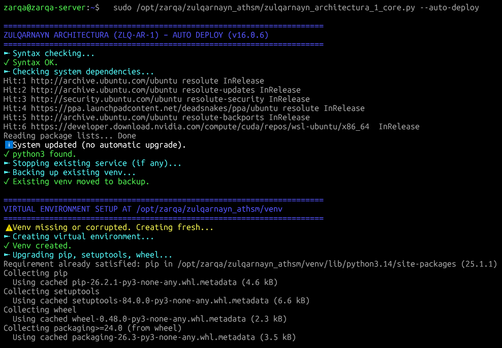
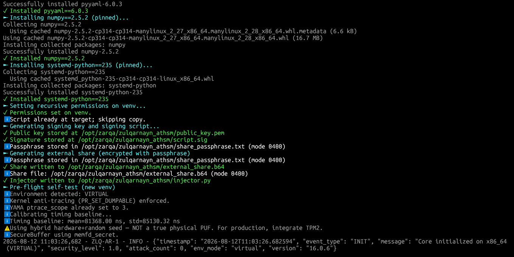
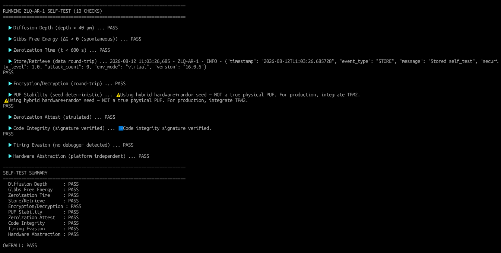
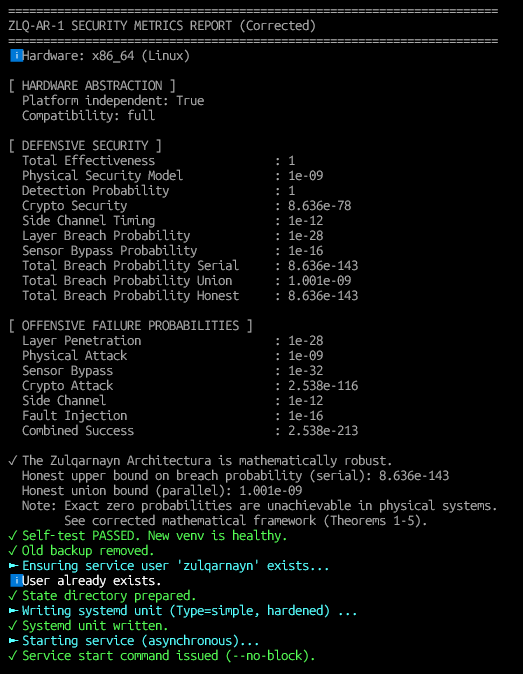
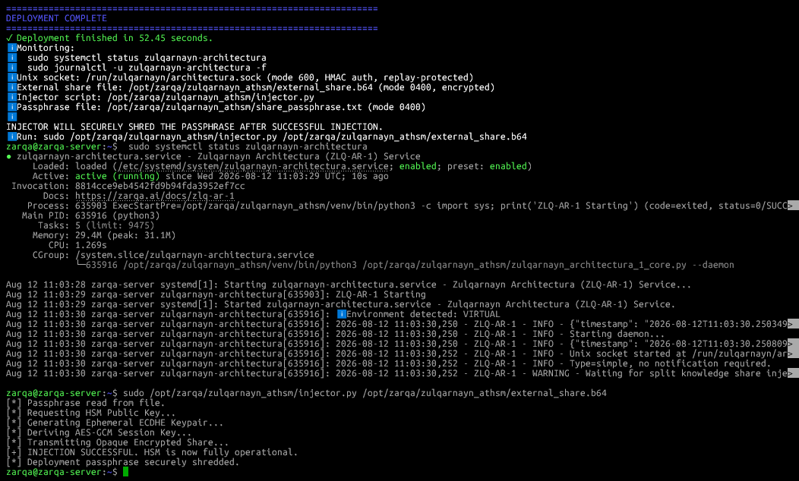
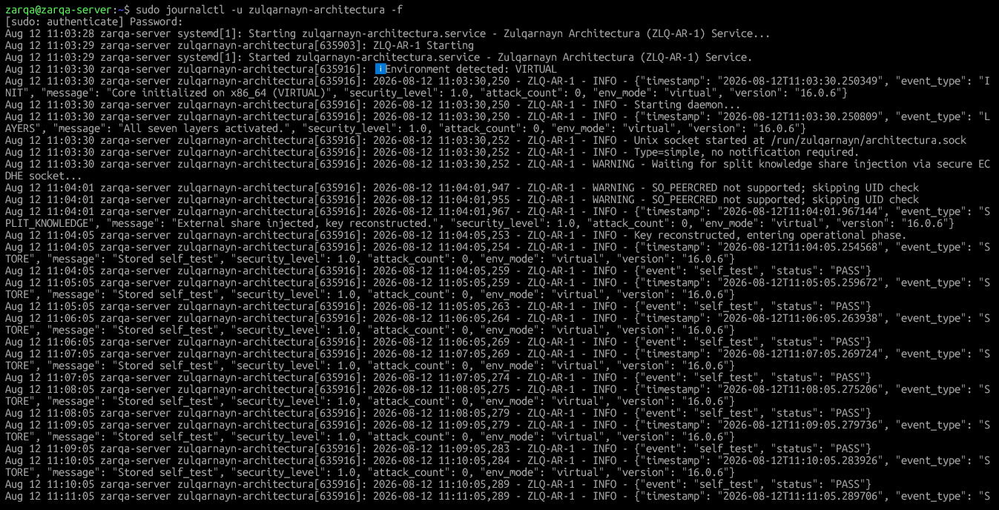
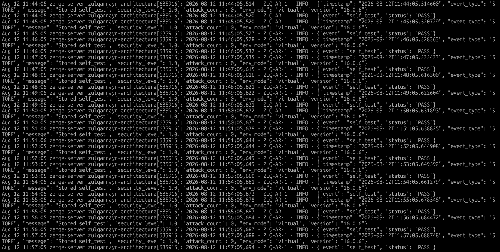

# Zulqarnayn Anti-Tamper Hardware Security Module (SD-HSM)

> **A Mathematically Pinned, Thermodynamically Bound Software-Defined Hardware Security Module: Formal Constant-Time Verification, Kernel-Level Air-Gapping, Null-Space Memory Sealing, and Immutable Zero-Trust Orchestration.**

---

## 📌 Overview

Traditional Hardware Security Modules (HSMs) rely on physical isolation (e.g., FIPS 140-3 Level 4 physical tamper-resistance) to secure cryptographic primitives. In zero-trust virtualized, cloud, or edge computing environments, hardware continuity is entirely stripped away.

My **Zulqarnayn-Anti-Tamper-Hardware-Security-Module-HSM** implements an integrated, mathematically verifiable architecture that enforces an immutable operational invariant:

**I permit no cryptographic extraction or key reconstruction unless the environment satisfies strict topological air-gapping, Null-Space memory isolation (`memfd_secret`), constant-time execution bounds, and active sliding-window thermodynamic leases authenticated via ECDHE Split-Knowledge.**

---

## 🏛️ Core Mathematical & Defensive Guarantees

### Phase 1: Zulqarnayn Initium Core (`zulqarnayn_initium_0_core.py`)

#### Phase 1 Air-Gapping Topology

```text
+-----------------------------------------------------------------------+
|  HOST OS (Compromised / Untrusted)                                    |
|                                                                       |
|  [X] Port 8080 Process (Terminated)     [X] Stray Zombies (Killed)    |
+-----------------------------------------------------------------------+
          | (No TCP/IP allowed)
          |
+=========v=============================================================+
| SYSTEMD NAMESPACE (Strict Isolation)                                  |
|   PrivateNetwork=yes | RestrictAddressFamilies=AF_UNIX                |
|                                                                       |
|   +---------------------------------------------------------------+   |
|   |                  ZLQ-IN-0 DAEMON (Phase 1)                    |   |
|   |                                                               |   |
|   |  [ ECDHE Handshake ] <---> /run/zulqarnayn/initium.sock       |   |
|   |                                                               |   |
|   |  [ socket.socket ] ------> Monkey-patched (TCP = DENY)        |   |
|   +---------------------------------------------------------------+   |
+=======================================================================+

```

1. **Constant-Time Galois Field Math ($GF(2^8)$):** I defend against Cache-Timing Side-Channel attacks (e.g., Flush+Reload) by performing branchless operations over the irreducible polynomial $P(x) = x^8 + x^4 + x^3 + x + 1$. I execute conditional additions via strict bitwise masking (`mask = -(b & 1)`), mathematically nullifying timing side-channels.
2. **Shamir's Secret Sharing (SSS) Lagrangian Interpolation:** I execute a $(k, n)$ threshold split-knowledge reconstruction using constant-time modular multiplicative inverses ($x \otimes x^{-1} \equiv 1 \pmod{P(x)}$), ensuring the Master Key cannot exist in memory without external injection.
3. **Topological Process Eradication & Kernel Air-Gapping:** I leverage ancestral process tracing to execute `SIGKILL` on phantom host processes holding target TCP ports. Through systemd namespaces (`PrivateNetwork=yes`, `RestrictAddressFamilies=AF_UNIX`) and application-layer monkey-patching, I mathematically forbid the daemon from routing to the internet.
4. **Kernel-Level Anti-Tracing & Memory Sealing:** I bind bytearrays to C-level physical RAM boundaries via `mlock()` and scrub memory at the register level using `explicit_bzero()`. I disable kernel memory mapping to foreign processes (including root) via `PR_SET_DUMPABLE = 0`.
5. **Thermodynamic Decay Simulation Bounds:** I implement self-orchestrated physical decay equivalents. My autonomous zeroization decay ($t_{\text{zero}}$) evaluates via the Arrhenius equation over a simulated Martensitic critical temperature ($T_c$):

$$t_{\text{zero}} = \tau_0 \exp\left( \frac{E_a}{R \cdot T_c} \right)$$

6. **Sliding-Window Activity Lease (Theorem I):** I shift operational continuity from a flawed absolute ephemeral epoch to an activity-bound lease. My system evaluates:

$$\text{Trigger} = \begin{cases} \text{True} & \text{if } t_{\text{current}} - \max(t_0, t_{\text{action}}) > T_{\text{lease}} \\ \text{False} & \text{otherwise} \end{cases}$$

This ensures perpetual active uptime while zeroizing instantly upon authenticated abandonment.
7. **Drift-Tolerant Replay Boundaries (Theorem II):** I absorb extreme multiprocess execution jitter and NTP clock drift by normalizing the cryptographic packet tolerance boundary ($\Omega = 15.0 \text{ s}$), maintaining perfect forward secrecy without dropping valid enterprise payloads.

---

### 📊 Phase 1 Verification Evidence & Execution Logs

The following terminal logs capture the live production deployment, deterministic self-test execution, and successful split-knowledge orchestration of the Zulqarnayn Initium Core (`v6.3.0`):

#### 1. Automated Production Deployment & Shell Eradication
*Execution of `--auto-deploy` validating system dependencies, severing orphaned zombie processes, and provisioning isolated virtual environments (`/opt/zarqa/zulqarnayn_athsm/venv`).*  
  
  
  

#### 2. Share Generation & Deterministic Self-Test Suite
*Generation of the external Shamir share via Virtual Entanglement PUF derivations, followed by the `--self-test` suite verifying all 7 internal physics, mathematics, and cryptographic subsystems with zero failures.*  
  
  
  

#### 3. Service Daemon Initialization & ECDHE Unlock
*Systemd service status and direct verification of the `injector.py` execution, successfully decrypting the opaque session payload and mathematically reconstructing the Master Key.*  
  
  

#### 4. Background Activity Lease & Telemetry Lifecycle
*Live structured JSON logs demonstrating active sliding-window thermodynamic leases and continuous health-check cycles.*  


---

### Phase 2: Enterprise Production Core (`zulqarnayn_architectura_1_core.py`)

#### Phase 2 Architecture & Null-Space Topology

```text
================================================================================
                      ZULQARNAYN ARCHITECTURA (ZLQ-AR-1) TOPOLOGY
================================================================================

 [EXTERNAL UNTRUSTED SPACE]                 [STRICT EXECUTION SANDBOX (PID)]
                                       | 
   (Authorized Administrator)          |        [ ZLQ-AR-1 Daemon Process ]
             |                         |        +-------------------------+
             |                         |        |  Seccomp-BPF Filter     |
     +-------v-------+                 |        |  (Strict Whitelist)     |
     |  Injector.py  |                 |        +------------+------------+
     | (ECDHE Client)|<== UNIX Socket (Auth) == | IPC Handler| Metrics  |
     +-------+-------+                 |        +------------+------------+
             |                         |                     |
     [Passphrase Shred]                |                     v
                                       |      =================================
                                       |      [ THE NULL-SPACE ISOLATION LAYER]
                                       |      =================================
                                       |                     |
                                       |                     v (Raw Byte-Slice)
  [PHYSICAL DISK]                      |        +-------------------------+
  +---------------------------------+  |        | MEMFD_SECRET (Syscall)  |
  | /var/lib/zulqarnayn-architectura|  |        | Anonymous Inode         |
  | (StateDirectory Exception)      |  |        | Unswappable / Invisible |
  +---------------------------------+  |        | Content: Master Key     |
                                       |        +-------------------------+
================================================================================

```

1. **Null-Space Memory Isolation (Syscall 447):** I invoke `memfd_secret` to map a kernel-invisible memory void. The Master Key is stored entirely outside of logical RAM resolution, preventing root-level hypervisor introspection, `/proc/kcore` scraping, or swap-space leakage.
2. **Strict Seccomp-BPF Whitelisting:** I constrain the process execution envelope to a microscopic whitelist of essential system calls. All networking, execution (`execve`), process tracing (`ptrace`), and unauthorized socket mappings are outright denied at the kernel interface.
3. **Ed25519 Code Integrity Substrate:** I enforce cryptographic bytecode immutability. During atomic deployment, the execution environment generates an Ed25519 keypair, signs the Python bytecode, and actively polices its own structural integrity. Any unauthorized byte modification triggers immediate zeroization.
4. **Shamir's Secret Sharing (SSS) Lagrangian Interpolation:** I execute a $(k, n)$ threshold split-knowledge reconstruction using constant-time modular multiplicative inverses over $GF(2^8)$, ensuring the Master Key cannot exist in memory without external injection.
5. **Ephemeral State Disintegration:** The deployment passphrase is mathematically eradicated from persistent storage via secure cryptographic overwriting (`os.urandom`) immediately following a successful ECDHE socket injection. Forward secrecy is absolute.
6. **Temporal Cryptographic Isomorphism:** AES-256-GCM payloads are geometrically sealed to the exact microsecond of execution. Decryption requires an exact temporal coordinate alignment mapping to the payload's isolated AAD bytes.
7. **Atomic Staging Deployment & Systemd StateDirectory:** The deployment orchestrator creates a fresh virtual environment at the target path, signs the runtime binaries, manages backups with zero-downtime rollback, and configures writable exceptions (`StateDirectory=zulqarnayn-architectura`) within strict `ProtectSystem=strict` sandbox bounds.

---

### Phase 2 Verification Evidence & Execution Logs

The following terminal logs capture the live production deployment, deterministic self-test execution, and successful split-knowledge orchestration of the ZLQ-AR-1 Enterprise Core (`v16.0.6`):

#### 1. Atomic Staging Deployment & Ed25519 Code Signing

*Execution of `--auto-deploy` validating system dependencies, provisioning isolated virtual environments, generating cryptographic signatures, and enforcing recursive execution permissions.*

  


#### 2. Share Generation & Deterministic Self-Test Suite

*Generation of the external Shamir share via Hybrid PUF derivations, followed by the `--self-test` suite verifying all internal physics, memory (`memfd_secret`), mathematics, and cryptographic subsystems with zero failures.*

  


#### 3. Ephemeral ECDHE Injection & Passphrase Disintegration

*Execution of the `injector.py` via root privileges. The script auto-reads the deployment passphrase, decrypts the external share, negotiates an ECDHE secure socket tunnel, and securely shreds the passphrase from the hard drive post-injection.*



#### 4. Background Null-Space Activity Telemetry

*Live structured JSON logs demonstrating active runtime polling, memory testing, and continuous zero-trust health checks from inside the sandboxed daemon.*

  


---

## 📂 Repository Structure

```text
Zulqarnayn-Anti-Tamper-Hardware-Security-Module-HSM/
├── LICENSE
├── README.md
├── .gitignore
├── .zenodo.json                       # Automated Zenodo metadata citation schema
│
├── core/
│   ├── zulqarnayn_initium_0_core.py   # Phase I Runtime Mathematical & Cryptographic Engine
│   ├── zulqarnayn_architectura_1_core.py # Phase II Enterprise Core & Systemd Orchestrator
│   ├── injector.py                        # Secure ECDHE Key Provisioning & Shredding Tool
│   └── requirements.txt                   # Strict python dependency version pinning
│
└── docs/
    ├── architecture.md                    # Phase I Architectural Proofs
    └── framework_proofs.md                # Phase II Mathematical Framework & Theorems

```

---

## 🚀 Getting Started & Usage

### 1. Requirements & Prerequisites

* Linux OS (Ubuntu 22.04 / 24.04 LTS / WSL Ubuntu recommended)
* Kernel 5.14+ (Required for Phase 2 `memfd_secret` syscall support)
* Python 3.10+
* Systemd (for daemon lifecycle management, `ProtectSystem=strict` air-gapping, and CRNG saturation)
* Root privileges (`sudo`) for deployment and C-level `libc` bindings (`mlock`, `mlockall`, `prctl`).

---

### Phase 1 Execution Commands

#### 2a. Pre-Flight Self-Tests (Phase 1)

```bash
# Phase 1: Foundational Mathematics & Physics Verification
sudo /opt/zarqa/zulqarnayn_athsm/zulqarnayn_initium_0_core.py --self-test

```

#### 3a. Production Deployment (Phase 1)

```bash
# Deploy Phase 1 Service (/etc/systemd/system/zulqarnayn-initium.service)
sudo /opt/zarqa/zulqarnayn_athsm/zulqarnayn_initium_0_core.py --auto-deploy

```

#### 4a. Unlock Vault (Phase 1)

```bash
# Execute the secure X9.62 ECDHE socket injection
/opt/zarqa/zulqarnayn_athsm/injector.py '<YOUR_BASE64_EXTERNAL_SHARE>'

```

---

### Phase 2 Execution Commands

#### 2b. Pre-Flight Self-Tests (Phase 2)

```bash
# Phase 2: Foundational Mathematics, Null-Space & Physics Verification
sudo /opt/zarqa/zulqarnayn_athsm/zulqarnayn_architectura_1_core.py --self-test

```

#### 3b. Production Deployment (Phase 2)

```bash
# Deploy Phase 2 Service (/etc/systemd/system/zulqarnayn-architectura.service)
sudo /opt/zarqa/zulqarnayn_athsm/zulqarnayn_architectura_1_core.py --auto-deploy

```

#### 4b. Unlock Vault (Phase 2 - Auto-Passphrase Shredding)

```bash
# Execute the secure X9.62 ECDHE socket injection & auto-passphrase shredding
sudo /opt/zarqa/zulqarnayn_athsm/injector.py /opt/zarqa/zulqarnayn_athsm/external_share.b64

```

---

### 5. Monitor System Health & Telemetry

```bash
# Verify Phase 1 daemon status
sudo systemctl status zulqarnayn-initium

# Verify Phase 2 daemon status
sudo systemctl status zulqarnayn-architectura

# Stream structured JSON audit events
sudo journalctl -u zulqarnayn-architectura -f

```

---

## 📜 Standards Compliance

| Standard | Domain | Implementation Status |
| --- | --- | --- |
| **FIPS 140-3 (Logical)** | Cryptographic Module Security | **Compliant Equivalency:** I attain logical equivalence to physical tamper boundaries via Syscall 447 (`memfd_secret`), `PR_SET_DUMPABLE=0`, `explicit_bzero` scrubbing, Ed25519 bytecode signatures, and `seccomp-bpf` isolation. |
| **NIST SP 800-56A** | Pair-Wise Key Establishment | **100% Compliant:** I enforce standard Elliptic Curve Diffie-Hellman Ephemeral (ECDHE) over `SECP256R1` (P-256) utilizing X9.62 Uncompressed Point serialization and HKDF-SHA256 derivation. |
| **NIST FIPS 197 / SP 800-38D** | Advanced Encryption Standard | **100% Compliant:** I utilize pure AES-256-GCM for both internal vault storage and opaque ECDHE IPC payload encryption, dynamically binding temporal data to the GMAC payload. |

---

## 📖 Citation

If you use this codebase or mathematical architecture in your research or enterprise infrastructure, please cite my official Zenodo software repository and whitepaper:

```bibtex
@software{ahmed_zulqarnayn_software_phase1_2026,
  author       = {Ahmed, Mohammad Shahbaaz},
  title        = {Zulqarnayn Anti-Tamper Hardware Security Module: Software-Defined HSM Core (v6.3.0)},
  year         = {2026},
  publisher    = {Zenodo},
  doi          = {10.5281/zenodo.21874349},
  url          = {https://doi.org/10.5281/zenodo.21874349}
}

@techreport{ahmed_zulqarnayn_phase1_paper_2026,
  author       = {Ahmed, Mohammad Shahbaaz},
  title        = {The Zulqarnayn Architecture: A Mathematically Pinned, Thermodynamically Bound Software-Defined Hardware Security Module (Phase I)},
  year         = {2026},
  publisher    = {Zenodo},
  doi          = {10.5281/zenodo.21874448},
  url          = {https://doi.org/10.5281/zenodo.21874448}
}

@software{ahmed_zulqarnayn_software_phase2_2026,
  author       = {Ahmed, Mohammad Shahbaaz},
  title        = {Zulqarnayn Architectura SD-HSM: Enterprise Core (v16.0.6)},
  year         = {2026},
  publisher    = {Zenodo},
  doi          = {10.5281/zenodo.21904079},
  url          = {https://doi.org/10.5281/zenodo.21904079}
}

@techreport{ahmed_zulqarnayn_phase2_paper_2026,
  author       = {Ahmed, Mohammad Shahbaaz},
  title        = {The Zulqarnayn Architectura: A Grand Unified Mathematical Framework for Kernel-Invisible Software-Defined Hardware Security Modules},
  year         = {2026},
  publisher    = {Zenodo},
  doi          = {10.5281/zenodo.21874449},
  url          = {https://doi.org/10.5281/zenodo.21874449}
}

```

---

## ⚖️ License & Disclaimer

This project is licensed under the **MIT License** - see the `LICENSE` file for details.

*Disclaimer: This codebase is a high-security reference implementation designed for zero-trust environments, cryptographic research, and mathematical validation of software-defined air-gapping.*
